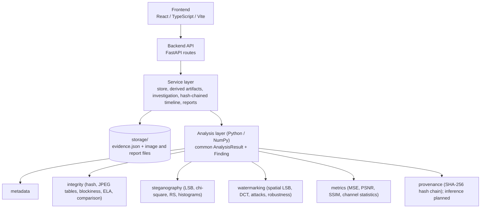

# VERIDIA

**Digital Image Provenance & Forensics Workbench**

*Veridia: Tracing Truth Through Digital Images*

> **Status: Phase 5, research prototype.** Evidence intake, metadata, LSB steganography (sequential, keyed and ±1 matching), spatial-, DCT- and DWT-domain watermarking, robustness experiments with parameter sweeps, statistical steganalysis, image-integrity analysis, experimental error level analysis and forensic comparison are connected in one investigation workflow. Evidence is persisted under `storage/`, the provenance timeline is a SHA-256 hash chain with tamper verification, and investigations export as HTML and JSON reports. See [Planned](#planned) for what is not implemented.

---

## Overview

VERIDIA is a proprietary workbench for investigating and experimenting with digital images from provenance, integrity and information-hiding perspectives. It brings evidence handling and several complementary techniques into one reproducible workflow, with every derived image linked to its source by a cryptographic hash.

## Academic Alignment

VERIDIA is developed for a **Digital Watermarking & Steganography** course. Watermarking and steganography are its technical core; the provenance and forensics layer exists to support and contextualize them.

```text
DIGITAL WATERMARKING                         STEGANOGRAPHY
        │                                            │
        ├── Ownership                                ├── Information hiding
        ├── Authentication                           └── LSB embedding
        ├── Integrity                                        │
        └── Robustness                                       ▼
                │                                    STEGANALYSIS
                ▼                                            │
        IMAGE PROVENANCE  ──────────────▶  FORENSIC INVESTIGATION  ◀──
                                         (evidence, integrity, comparison, timeline)
```

In VERIDIA these meet in one workflow: an evidence image is hashed and recorded; watermarking and steganography create **derived artifacts** linked to it; and the investigation view runs metadata, integrity, steganalysis, watermark verification and comparison on any of those images. For example, the integrity module detects the 8×8 block structure the DCT watermark leaves in a PNG, and the comparison module shows that LSB embedding changes pixels only by ±1.

The algorithms are implemented directly with NumPy rather than by wrapping a steganography or watermarking library. Pillow is used only to decode and encode image files.

### Watermarking vs. steganography

The two share low-level mechanisms (here, both modify least significant bits) but have different goals:

| | Steganography | Digital watermarking |
| --- | --- | --- |
| **Purpose** | Conceal communication or data inside a carrier | Associate information with media: ownership, authentication, integrity, provenance |
| **Secrecy** | The *existence* of the message should go unnoticed | The mark need not be secret; it must be recoverable and verifiable |
| **Typical priority** | Capacity and imperceptibility | Verifiability and (for robust schemes) resistance to processing |
| **In VERIDIA** | Sequential LSB embedding of text, up to full capacity | Short, CRC-protected message repeated across the image at key-derived positions |

## Problem Statement

Investigating a digital image rarely depends on one technique. An analyst may need to inspect metadata, verify integrity, search for hidden information, verify watermarks and reason about provenance. These tasks are usually done in separate tools, which makes results hard to reproduce and correlate. VERIDIA aims to unify them around evidence preservation and explainable results.

## Current Status

### Implemented

- **Evidence ingestion:** upload of PNG/JPEG/BMP with extension, file-signature and decode validation; size (10 MB) and pixel (8 MP) limits; sanitized filename; unique evidence ID; SHA-256; dimensions; timestamp. The original bytes are stored unmodified.
- **Metadata extraction:** format, dimensions, colour mode, bit depth, ICC profile and EXIF (including Exif and GPS sub-IFDs). Each field is reported as *available*, *not available* or *unknown*; nothing is inferred.
- **LSB steganography:** embed and extract UTF-8 text, capacity calculation and utilization, rejection of over-capacity payloads, graceful handling of images without a payload. Three variants: the original sequential embedder, a **keyed** embedder (pseudo-random sample order derived from a secret key) and **LSB matching** (±1 adjustment instead of bit replacement). All three produce derived artifacts with provenance.
- **Experimental sample-pair screen and detector evaluation:** an adjacent-pair parity statistic and an evaluation harness reporting detection and false-positive rates for labelled cover/stego images. Available through the API only (not in the steganalysis report, the investigation pipeline or the UI). It is not a calibrated sample-pair estimator.
- **Steganalysis:** per-channel statistics (mean, std, entropy, LSB ratios), histograms and pair-of-values differences, the chi-square attack (whole image and sequential prefixes), RS analysis, LSB-plane images, and a direct known-cover vs. suspected-image comparison. Results are reported as measurements and potential indicators.
- **Spatial-domain watermarking:** keyed, redundant LSB watermark with embed and verify/extract.
- **DCT-domain watermarking:** blind watermark in the relation between two mid-frequency coefficients of 8×8 luminance DCT blocks, with adjustable strength, embed and verify/extract, and a DCT-coefficient visualisation.
- **DWT-domain watermarking:** blind watermark in the relation between the HL and LH detail sub-bands of a one-level Haar wavelet transform of the luminance channel (transform written directly in NumPy), with adjustable strength, embed and verify/extract, and a sub-band visualisation.
- **Robustness testing:** JPEG recompression, resize-and-restore, Gaussian noise, brightness, contrast, border crop, true crop (border removed and rescaled) and rotation, for all three watermarking methods; single experiments (stored with provenance) or a full suite, reporting PSNR/SSIM, raw bit error rate and verification status.
- **Parameter sweeps:** one attack swept across a range for one or all three methods (JPEG quality 10-100 by default), plotted as bit error rate with verified and not-recovered points distinguished. Sweeps are bounded and validated before any artifact is created.
- **Method comparison:** spatial, DCT and DWT watermarks on the same image and message: imperceptibility, verification and the same attack suite, side by side.
- **Quality metrics:** MSE, PSNR, SSIM between original and processed images.
- **Evidence object and provenance chain:** each evidence item records its identity, metadata, every **derived artifact** (own ID and SHA-256, parent image and parent hash, operation, timestamp), every image-producing operation, every recorded analysis result, and a **timeline** of the operations the application performed.
- **Common analysis results:** every analyzer returns the same structure (status, measurements, findings, interpretation, limitations, timestamp). Each **finding** states the observation, the measurement supporting it, what it may indicate, and what it does *not* establish.
- **Image-integrity analysis:** SHA-256 re-verification, format and image characteristics, R/G/B/grayscale statistics and histograms, JPEG quantization tables with IJG quality estimation, chroma subsampling, and an 8×8 blockiness measurement for compression history in lossless files.
- **Forensic comparison:** reference vs. derived/suspected image with side-by-side view, difference map, MSE/PSNR/SSIM, changed-pixel statistics, histogram overlay and channel statistics.
- **Error level analysis (experimental):** JPEG recompression error per pixel, block statistics with robust z-scores, connected outlier clusters, an error-level map and a block-score overlay. Reported as a potential indicator only.
- **Investigation workflow:** one view per evidence item that runs metadata → integrity → (ELA) → steganalysis → (watermark verification) → (comparison with the original) on the original or any derived artifact, and shows the findings, the artifact tree and the timeline.
- **Persistence:** every evidence item is stored under `storage/evidence/<id>/` as `evidence.json` plus write-once, read-only image and report files, and reloaded on restart. No database.
- **Hash-chained timeline:** each timeline event carries its sequence number, the previous event's hash, the hash of the record it covers and its own SHA-256 over canonical JSON.
- **Tamper verification:** re-derives the chain, every covered record, artifact lineage and the hash of every stored file, optionally against a head hash recorded elsewhere, and reports exactly which event, record or file is inconsistent.
- **Investigation reports:** one click exports a machine-readable JSON report and a self-contained, printable HTML rendering (inline thumbnails and SVG, no scripts); both are hashed, stored and anchored in the chain.
- **Extensible provenance operations:** operation names are registered identifiers with labels and categories (`GET /api/provenance/operations`) rather than a closed enum, so new operations need no schema or frontend change.
- **Frontend:** Dashboard, Evidence, Investigation, Steganography, Steganalysis, Watermarking (Spatial / DCT / DWT / Compare Methods / Robustness Testing), Comparison, Provenance (SVG provenance graph, hash-chained timeline, verification) and Reports views. The Steganography page offers the sequential, keyed and LSB-matching modes.
- **Tests:** a pytest suite under `tests/` (run `pytest`) covering the analysis algorithms, the API workflows, persistence round trips, tamper scenarios, ELA on synthetic splices, report escaping and request validation. It uses deterministic synthetic images; the test count changes as the project grows, so run `pytest` for the current number.

### Planned

Calibrated manipulation localisation (ELA is experimental), geometrically robust watermarking (none of the implemented methods resynchronises after rotation or a true crop), a calibrated sample-pair estimator and detectors for LSB matching (the implemented chi-square and RS analyses do not target it), multi-evidence cases, authentication. See the [Roadmap](#roadmap).

## Technical Methodology

### Cryptographic hashing
SHA-256 is computed over the exact uploaded bytes and over every generated file. Any change to a file, however visually imperceptible, changes its hash, so a processed image never shares the original's hash. Hashes link each derived artifact to its source.

### LSB steganography
The cover is decoded to 8-bit RGB. The least significant bit of each colour sample, taken in row-major order (R, G, B per pixel), carries one payload bit. Changing an LSB alters a sample by at most 1 of 255, which is normally imperceptible. The stream is `"VRDS" | 4-byte length | payload`. Capacity is `H·W·3/8 − 8` bytes. Outputs are always lossless PNG, because lossy compression (JPEG) would destroy the hidden bits.
*Limitations:* the payload is not encrypted, the layout is sequential and the header is a fixed marker, so the scheme is easy to detect and read. It is a teaching baseline, not a secure channel.

### Keyed LSB steganography
Same bit-replacement principle as above, but the samples that carry the payload are visited in a pseudo-random order instead of sequentially. The order is a permutation of all colour samples seeded from SHA-256 of a domain tag, the key length, the key and the image shape, so the same key and an image of the same size reproduce it. The stream is `"VKLS" | 4-byte length | payload`, capacity is `H·W·3/8 − 8` bytes, and a key is required (an empty key is rejected). Extraction with a wrong key, or from an image with no payload, reports that no payload was found. The key is used for embedding and extraction only and is not written to provenance records.
*Limitations:* the payload is not encrypted, and deriving a PRNG seed from SHA-256 is a demonstration, not production cryptography. Only one bit per sample is implemented: the API's `bits_per_channel` field accepts only `1`.

### LSB matching (±1) steganography
For each payload bit, at a pseudo-random sample, if the sample's LSB already equals the bit it is left alone; otherwise the sample is changed by +1 or −1 (chosen pseudo-randomly; 0 can only go up and 255 only down). Unlike replacement, this does not push values within pairs (2k, 2k+1) towards equality, which is the effect the chi-square attack looks for. The sample order comes from NumPy's generator seeded with an integer `seed` (0 to 2³²−1). That seed is **not secret**: it is a small integer and is recorded in the provenance parameters. There is no header and no length field, so extraction requires the payload length in bytes and the same seed; capacity is `H·W·3/8` bytes. The embedding itself is vectorised, so large payloads embed quickly.
*Limitations:* the payload is not encrypted, extraction with a wrong length or seed simply returns other bytes (or reports that they are not valid UTF-8), and the other steganalysis measurements below were not designed to detect it. Measured once, on one 256×256 synthetic image with a random payload at 50% of capacity: the chi-square prefix test and RS analysis both flagged sequential LSB; only RS flagged keyed LSB; neither flagged LSB matching (RS estimate about 0.06, against about 0.04 for the clean cover). This is one image and one payload, not a detection-rate claim.

### Experimental sample-pair screen and detector evaluation
`analysis/steganography/spa.py` computes a simple statistic over adjacent samples (in row-major order, all channels): the fraction of neighbouring pairs whose LSBs agree, reported as `score = 2·|agree rate − 0.5|` together with the pair counts. It is an **adjacent-pair parity screen**, not the classical sample-pair analysis estimator of embedded payload length, and the score is not a probability. `analysis/steganography/evaluation.py` classifies a score at or above a threshold (default 0.05) as stego and reports, per payload rate, the detection rate on the supplied stego images and the false-positive rate on the supplied cover images. These rates describe only the images and threshold supplied. The screen was not evaluated on real photographs, and is exposed only through `POST /api/steganography/spa/evaluate`.

### Steganalysis
All outputs are **measurements and potential indicators**. Natural images, noise and prior processing can produce similar values, and a small or well-spread payload may produce none; nothing here establishes that data is hidden.
- **LSB planes and channel statistics:** LSB-plane images; per channel the mean, standard deviation, entropy, fraction of LSBs equal to 1 and fraction of differing horizontal LSB neighbours (≈0.5 for random bits).
- **Histogram / chi-square attack** (Westfeld & Pfitzmann): LSB replacement only moves values within pairs (2k, 2k+1), so random message bits equalise each pair's counts. A chi-square test against perfectly equalised pairs gives *p*; *p* close to 1 is consistent with embedding. Run over growing prefixes of the sample stream, it exposes sequential embedding (high *p* over the embedded prefix, then a drop). It assumes random-looking message bits (encrypted or compressed). Plain ASCII text has a fixed 0 bit in every byte and often goes unflagged.
- **RS analysis** (Fridrich, Goljan & Du): pixel groups are classified as Regular/Singular under LSB flipping with a mask and its shifted counterpart. Embedding moves these counts in a predictable way, which gives an estimate of the fraction of samples carrying message bits. Expect a few percent of bias on clean images; the estimate is undefined near full embedding. Treat it as an experimental detector.
- **Known cover vs. suspected image:** when the true cover is available, changes are measured directly (count, location range, largest change, LSB-only or not) instead of inferred.

Indicator thresholds (chi-square *p* > 0.95; RS estimate > 10%) are heuristics documented in `analysis/steganography/steganalysis.py`. VERIDIA's own payload header is reported separately as a direct format match.

### Spatial-domain watermarking
A 73-byte block (`"VRDW" | length | message padded to 64 bytes | CRC-32`) is repeated cyclically over every colour sample. Bit *k* of the repeated stream is written to the LSB of sample `perm[k]`, where `perm` is a pseudo-random permutation seeded by SHA-256 of the key, so the result is deterministic. Verification re-derives the permutation, takes a per-bit majority vote across the copies, and checks the magic value and CRC. The result is *verified*, *mismatch*, *extracted* (no expected message supplied) or *not found*.
*Limitations:* this is a **fragile** watermark. JPEG compression, resizing, cropping and filtering destroy it; only sparse random bit damage is tolerated. With an empty key the positions are public, and a key only hides the bit locations; it does not authenticate the image. Embedding overwrites all LSBs, so it erases any LSB steganography payload.

### DCT-domain watermarking
The image is converted to YCbCr and the luminance channel is split into 8×8 blocks. Each block is transformed with the 2-D DCT-II (implemented directly as `D·B·Dᵀ`). Each block carries one bit in the relation between coefficients C(4,1) and C(3,2): their difference is pushed to ≥ +*strength* for a 1 and ≤ −*strength* for a 0. These mid-frequency positions avoid the most visible low frequencies and the high frequencies that JPEG discards first, and they share the same JPEG quantisation step, so recompression tends to preserve their difference. The payload (`length | message ≤ 16 bytes | CRC-32`, 168 bits) is repeated over all blocks at key-permuted positions. After the inverse DCT the image is converted back to RGB.
Extraction is **blind** (no original needed): recompute the block DCTs, combine each bit's copies by clipped soft voting, and check the CRC. If the original is supplied, it is used only to report metrics against it.
*Limitations:* no geometric resynchronisation, so rotation, true cropping or any shift of the 8×8 grid prevents extraction (the resize attack restores the original size). Capacity is 16 bytes, and at least 504 blocks (≈180×180 px) are needed. Strength trades imperceptibility for robustness, and the default (25) was chosen from measurements on test images, not derived.

### DWT-domain watermarking
The image is converted to YCbCr and a one-level 2-D Haar wavelet transform (implemented directly in NumPy, orthonormal, exactly invertible up to floating-point rounding) splits the luminance channel into four half-size sub-bands: LL (a blurred half-size copy), LH and HL (edge detail) and HH (diagonal detail). Each position of the detail bands carries one bit in the relation between the two directional coefficients at that position: HL − LH is pushed to ≥ +*strength* for a 1 and ≤ −*strength* for a 0, using the same adjustment as the DCT scheme. LL is avoided because it holds the visible structure and HH because compression discards it first. The payload (`length | message ≤ 16 bytes | CRC-32`, 168 bits, the same block as the DCT scheme) is repeated over all positions in a key-permuted order, and the default strength is 8. Because the transform covers the whole image rather than 8×8 blocks, one position per 2×2 pixels is available, so far more copies of the payload are carried than in the DCT scheme.
Extraction is **blind**, using the same clipped soft voting and CRC check as the DCT scheme.
*Limitations:* no geometric resynchronisation; capacity is 16 bytes and at least 504 positions (about 48×48 px) are needed; an odd final row or column is left untouched. A single Haar level places LH and HL in the highest frequency octave, so the mark is less JPEG-robust than the DCT mark (measured figures are in the next section). The strength setting of the comparison view applies to the DCT method only, because DCT and DWT strengths are on different scales.

### Robustness testing
Attacks (`analysis/watermarking/attacks.py`) are JPEG recompression, resize-and-restore, seeded Gaussian noise, brightness shift, contrast scaling, border crop (filled with black; content stays in place), true crop (border removed and the rest rescaled, so content moves) and rotation (content stays rotated). Each attack keeps the image dimensions. For each attack VERIDIA records the parameter, the attack's distortion (MSE/PSNR/SSIM relative to the watermarked image), the **raw bit error rate** (carrier bits that differ from what was embedded, before voting) and whether the watermark still verifies. No aggregate "security score" is computed.

**Brightness presets are odd (±25) on purpose.** An even shift never changes a least significant bit, so a spatial LSB mark trivially "survives" it (it did, with ±20, and inflated that method's survival count from 1 to 3). Any odd shift flips every LSB (bit error rate ≈ 1.0). The transform-domain marks are insensitive to the parity.

A parameter sweep (`POST /api/watermark/sweep`) runs one attack across a range, defaulting to JPEG quality 10-100 in steps of 10, or an attack's whole documented range in ten steps. A sweep is limited to 100 points per method (`MAX_SWEEP_POINTS`, because each point is a full attack plus a decode); invalid or excessive requests are rejected before any watermarked artifact is created.

Example, measured on a 512×384 synthetic test image (lossless PNG, message `VERIDIA`, key `k`, default strengths: DCT 25, DWT 8). Survival means the expected message was still recovered. The attack-survival counts were identical on a JPEG-sourced version of the same picture and on a 256×256 version; the counts and the JPEG sweep come from one picture family and are not general claims:

| | PSNR | SSIM | Verified after attack (20 presets) |
| --- | ---: | ---: | ---: |
| Spatial LSB watermark | 51.1 dB | 0.996 | 1 / 20 (only the 10% border crop) |
| DCT watermark | 41.1 dB | 0.943 | 13 / 20 (failed: JPEG q30, 25% crop, both true crops, rotations of 0.5°, 2° and 5°) |
| DWT watermark | 38.6 dB | 0.903 | 12 / 20 (failed: JPEG q50 and q30, resize 0.5, both true crops, rotations of 0.5°, 2° and 5°) |

JPEG sweep, same image, on the sweep's 10-point grid (verified from quality): spatial never, DCT from 50, DWT from 70. These are grid values, not thresholds. Stepping quality by 1, the lowest quality from which the mark verifies at every higher setting was 41 for DCT and 63 for DWT here. Across 5 images (256×256 and 512×384), 2 messages and 3 chroma-subsampling settings (30 configurations) it was 40-42 for DCT and 61-69 for DWT. The result was insensitive to chroma subsampling (at most 4 quality points) and moved more with the image and message, but only Pillow 12.3.0 was measured.

None of the three methods resynchronises geometry, and the measurements show where that bites. Every true crop tested (2%, 5%, 10%) defeated all three methods in all 11 image/message configurations. For rotation, DCT and DWT still verified at 0.25° in 11 of 11 configurations, but only 3 of 11 (DCT) and 2 of 11 (DWT) at 0.5°, and none at 1° or more; the spatial mark failed at every angle tested. So the 0.5° row above is borderline and depends on the image and message, not a general result.

### Image-quality metrics
- **MSE:** mean squared difference over all samples. 0 means identical; lower means less pixel-level change.
- **PSNR:** `10·log₁₀(255² / MSE)` in dB. Higher generally indicates closer agreement with the original; it is undefined (shown as ∞) for identical images.
- **SSIM:** structural similarity (Wang et al., 2004) computed over a 7×7 uniform sliding window and averaged over R, G, B. 1.0 means identical. Other libraries use a Gaussian window, so values can differ slightly.

No "good" or "bad" threshold is claimed; interpretation depends on the application.

### Image-integrity analysis
- **Hash re-verification:** the stored bytes are re-hashed and compared with the SHA-256 recorded on entry. This shows integrity *since acquisition*, not before it.
- **JPEG compression:** quantization tables are read from the file. Most encoders scale the standard tables (ITU-T T.81 Annex K) with the IJG formula (`scale = 5000 // Q` for Q < 50, `200 − 2Q` otherwise), so VERIDIA estimates quality as the Q whose scaled table is closest. It reproduces Pillow-encoded qualities 1–100 exactly. Non-standard tables (typical of camera firmware) are reported as such, with an approximate estimate.
- **Blockiness:** the ratio of luminance steps across 8×8 block boundaries to steps inside blocks. It is ≈1.0 without block structure. Measured on synthetic test images: JPEG q95 ≈1.13, q50 ≈2.1, VERIDIA's DCT watermark ≈1.36. In a *lossless* file a ratio above 1.10 is reported as a potential indicator of earlier JPEG or block-DCT processing; the threshold is a heuristic, not a calibrated detector.
- **Channel statistics:** mean, standard deviation, min and max, plus histograms, for R, G, B and grayscale (BT.601 luma).

No finding from this module claims that compression or statistics prove manipulation.

### Error level analysis (experimental)
The image is re-encoded once as JPEG at quality *Q* (default 90, selectable 50–99) and the per-pixel error level is `max over R,G,B of |I − JPEG_Q(I)|`. JPEG quantisation is nearly idempotent, so content already quantised at a similar quality changes little while content with a different history (never compressed, or pasted in after the last save) changes more.
- **Blocks:** error levels are averaged over 16 px blocks aligned to the JPEG grid (larger blocks for big images, at most 64 per side) and scored with a robust z-score against the image, `z = 0.6745·(block − median)/MAD`, with the MAD floored at 0.25.
- **Outliers:** blocks with *z* > 6 are outlier blocks; 4-connected outliers are reported as clusters with pixel bounding boxes (breadth-first search; no SciPy).
- **Status:** *indicator detected* when outlier blocks exist, *no indicator* otherwise, *inconclusive* when recompression changes almost nothing, *not applicable* below 16 blocks.
- **Measured on synthetic images:** a 64×64 region pasted from an uncompressed source into a JPEG q75 image scored *z* > 10 in every block, saved losslessly or re-saved as JPEG q95. The same images without a splice still produce outlier blocks along hard, high-contrast edges.

*Limitations:* ELA responds to edges, fine texture, noise and saturated colour as strongly as to compression history. The threshold is a heuristic, not a calibrated detector, and a uniform error level does not show that nothing was changed. Use the overlay to see *where* the image responds differently, then corroborate.

### Analysis results and findings
Every analyzer (`analysis/core/base.py`) returns `status`, `measurements`, `findings`, `interpretation`, `limitations` and `timestamp`. Status is one of **Verified** (a definite check succeeded, e.g. a watermark matched), **Indicator detected**, **No indicator detected**, **Inconclusive** or **Not applicable**. Each finding has four parts:

```text
Finding:        Image is JPEG compressed
Evidence:       2 quantization tables; luminance table matches IJG quality 88 (deviation 0.00)
Interpretation: The pixel data has been lossy-compressed at least once.
Limitation:     JPEG compression alone does not establish manipulation.
```

Findings are not combined into an authenticity score. No defensible model for such a score exists in this project.

### Provenance tracking
Two kinds of images are distinguished:
- **Original evidence:** the uploaded file. It is stored unmodified, and integrity analysis re-verifies its hash.
- **Derived artifacts:** images produced by steganographic embedding, watermark embedding or robustness attacks. Each has its own ID and SHA-256, a parent reference (evidence or another artifact) with the parent's hash, the operation and its parameters, a timestamp and quality metrics against the parent.

```text
Original Evidence (SHA-256)
   ├── DCT Watermark Embedding ──▶ watermarked.png (SHA-256, strength, PSNR/SSIM)
   │       └── Attack: JPEG q75 ──▶ watermarked_jpeg_75.png (SHA-256, distortion metrics)
   └── LSB Steganography ──▶ stego.png (SHA-256, payload size, PSNR/SSIM)
```

The **timeline** records only operations the application performed: acquisition, metadata extraction, hashing, artifact creation, each recorded analysis with its result status, and report exports. Analyses are recorded when run from the Investigation or Comparison views. Exploratory views (e.g. the Steganalysis page) are not recorded. Payloads, watermark messages and keys are never stored in operation records.

**Operation names** are registered identifiers (`backend/app/services/operation_registry.py`): each has a label, an output label, a category and a description. `derive()` refuses unregistered names; records carrying a well-formed name this build does not know still load and are shown with a readable fallback label. Adding an operation is one `register_operation(OperationSpec(...))` call.

### Hash-chained timeline and tamper verification
Every timeline event is a link in a SHA-256 hash chain (`analysis/provenance/chain.py`):

```text
hash_n = SHA-256( canonical_json({ sequence: n, event_id, timestamp, event_type, subject_image_id,
                                   description, reference_id, content_hash, previous_hash: hash_{n-1} }) )
hash_{-1} = 000…000 (genesis)        canonical JSON = sorted keys, compact separators, UTF-8, no NaN
```

`content_hash` is the SHA-256 of the record the event covers (the evidence identity, its metadata, a provenance record together with its derived artifact, an analysis record or a report record), computed on the record exactly as persisted. `GET /api/provenance/{id}/verify` re-derives everything and reports each check separately:

| Check | Detects |
| --- | --- |
| Chain links and sequence | removed, inserted or reordered events |
| Event hashes | an edited event |
| Covered records | an edited provenance, analysis or report record, or edited metadata |
| Coverage | records added outside the application (no event covers them) |
| Artifact lineage | parent links or parent/child hashes that do not agree |
| Stored files | changed or missing image and report files |
| Expected head (optional) | truncation or a complete rewrite since a head hash was recorded elsewhere |

*Limitations:* the chain makes the record tamper-*evident*, not tamper-proof. Anyone who can rewrite `storage/` can also recompute every hash; dropping the newest events, or rewriting the whole chain, is only detectable against a head hash kept somewhere else. Every report states the head it covers for that purpose. The chain is not signed and there is no trusted timestamp.

### Persistence
State is stored as plain files under `storage/` (configurable with `VERIDIA_STORAGE_DIR`; `VERIDIA_PERSIST=false` keeps everything in memory):

```text
storage/evidence/<evidence_id>/
    evidence.json                 the EvidenceArtifact: metadata, provenance, analyses, reports, hash-chained timeline
    images/<image_id>.<ext>       original bytes (unmodified) and derived artifacts (PNG), write-once, mode 0400
    reports/<report_id>.json|html exported reports, write-once, mode 0400
```

Directories are created 0700. `evidence.json` is replaced atomically (temp file, fsync, rename). Every path component is a server-generated ID validated against a fixed pattern; anything else under `storage/` is ignored. A record that fails to load is skipped, logged and counted in `/api/health`; it does not stop the others. Image bytes are read from disk on each access, so integrity analysis and verification see the file as it is now.

### Investigation reports
`POST /api/reports/{id}` writes a snapshot of the record as JSON (`veridia.investigation-report`, schema version 1) and as HTML generated with `string.Template` and `html.escape`. The report contains the evidence identity and metadata, every image with its hash re-checked at export, the provenance tree and operations, every recorded analysis with findings and limitations, the hash-chained timeline, a chain verification and the head hash it covers. The HTML has inline thumbnails and SVG (ELA block maps) only and is served with a Content-Security-Policy that forbids scripts and remote resources. The export itself is then recorded as a `report_exported` event whose content hash covers both file hashes. Reports add no conclusions.

## Planned Capabilities

| Module | Intended scope |
| --- | --- |
| **Evidence Management** | Multi-evidence cases, retention and deletion policy. |
| **Metadata & Provenance** | Metadata consistency checks and richer origin/history reasoning. |
| **Image Integrity** | Calibrated manipulation localisation (noise residuals, double-JPEG detection) beyond the experimental ELA. |
| **Steganography Analysis** | A calibrated sample-pair estimator, detectors targeting LSB matching, calibrated evaluation on real image sets. |
| **Digital Watermarking** | Geometrically robust watermarking (synchronisation after rotation or crop), multi-level wavelet embedding, more attack types. |
| **Forensic Investigation** | Signed chain heads or trusted timestamps; examiner identity and notes. |
| **Reporting** | PDF output; report diffing between exports. |

## Architecture



Route handlers only validate and delegate. Algorithms live in `analysis/` and are usable and testable without the web layer.

## Technology Stack

- Frontend: React 19, TypeScript, Vite, Tailwind CSS, React Router
- Backend: Python, FastAPI, Pydantic, Uvicorn, python-multipart
- Analysis: NumPy, Pillow (image file decode/encode, metadata read, JPEG recompression for ELA)
- Records and reports: Python standard library (`json`, `hashlib`, `html`, `string.Template`); plain files, no database
- Testing: pytest, httpx

## Security Principles

Uploaded files are untrusted. Details and status are in [docs/security.md](docs/security.md).

- **Implemented:** signature + extension + decode validation; size and pixel limits; sanitized display filenames; server-generated, pattern-validated IDs as the only path components; write-once read-only image and report files in 0700 directories; atomic record updates; files never executed; images served with `nosniff`; HTML reports escaped and served with a script-blocking CSP; SHA-256 at intake, for derived files and reports; a hash-chained, verifiable timeline; payloads and keys excluded from provenance.
- **Not yet implemented:** authentication, rate limiting, streaming size enforcement during upload, signed chain heads.

## Forensic Philosophy

VERIDIA reports **forensic indicators and supporting evidence**, not verdicts. It does not declare an image "authentic" or "fake," and it does not claim steganography is "detected" from a bit-plane statistic. Each indicator should be interpreted in context and corroborated by independent techniques. See [docs/forensic-philosophy.md](docs/forensic-philosophy.md).

## Roadmap

**Phase 1: Foundation** ✔
**Phase 2: Core Watermarking & Steganography Pipeline** ✔
- Evidence intake, hashing, metadata, LSB steganography, LSB analysis, basic watermarking, quality metrics, provenance record

**Phase 3: Transform-Domain Watermarking, Robustness & Steganalysis** ✔
- DCT-domain watermarking, spatial vs. DCT comparison
- Attack suite and robustness measurement
- Channel statistics, histogram/chi-square attack, RS analysis, known-cover comparison

**Phase 4: Forensic & Provenance Integration** ✔
- Evidence object with derived artifacts, provenance chain and timeline
- Common analysis-result and finding structure
- Image-integrity analysis (hash re-verification, JPEG tables, blockiness, channel statistics)
- Forensic comparison and unified investigation workflow

**Phase 5: Investigation Reports, Persistence & Tamper Evidence** ✔
- File-based persistence under `storage/` (JSON + image files)
- SHA-256 hash-chained timeline and tamper verification
- HTML + JSON investigation reports
- Experimental error level analysis
- Extensible provenance operation registry; provenance graph UI

**Phase 5b: DWT Watermarking, Geometric Attacks, Sweeps & Steganography Variants** ✔ (this release)
- DWT-domain watermarking; three-method comparison
- Rotation and true-crop attacks; bounded, validated parameter sweeps with a chart
- Keyed LSB and LSB matching embedding; experimental adjacent-pair screen and evaluation harness

**Phase 6: Further Watermarking & Steganalysis**
- Geometric resynchronisation; multi-level wavelet embedding
- A calibrated sample-pair estimator; detectors for LSB matching
- Calibrated manipulation localisation; evaluation on real image datasets

## Limitations

- Image forensics is largely probabilistic; no single signal proves manipulation or authenticity.
- The LSB steganography variants and the spatial watermark are educational baselines: unencrypted and not secure channels. Keyed LSB derives its order from a key but encrypts nothing; the LSB-matching seed is a small public integer, and its extraction needs the payload length.
- The DCT and DWT watermarks have no geometric resynchronisation and a 16-byte capacity. Robustness results are measured on the image at hand and do not generalise automatically.
- The adjacent-pair screen is experimental and unvalidated on real photographs; it is not a calibrated sample-pair analysis estimator and is not part of the steganalysis report or investigation pipeline. The keyed LSB API field `bits_per_channel` accepts only `1`.
- Steganalysis results were validated only on synthetic test images and the tool's own embedder. The chi-square attack assumes random-looking payloads, and RS analysis is experimental. Neither is a calibrated detector.
- Robustness suites and method comparison run synchronously; on large images they can take several seconds.
- Integrity findings are descriptive. Blockiness is a heuristic calibrated on synthetic images; JPEG table analysis cannot identify devices or detect double compression.
- The timeline documents what VERIDIA did after acquisition, not the image's history before upload. It is tamper-evident, not tamper-proof: without an externally recorded head hash, truncation or a full rewrite of `storage/` cannot be detected.
- ELA is experimental: edges and texture trigger it as readily as a different compression history.
- Operations are on the decoded 8-bit RGB image: alpha channels are dropped, 16-bit data is reduced, and EXIF orientation is not applied. Outputs are always PNG.
- Storage is single-node plain files with a process-wide lock; it is not designed for several backend processes sharing one `storage/` directory.
- Accuracy of results depends on the lossless handling of the file; do not re-save outputs as JPEG.

## Development

### Prerequisites

- Node.js 20+ and npm
- Python 3.11+

### Backend

From the repository root:

```bash
python -m venv .venv
# Windows: .venv\Scripts\activate    macOS/Linux: source .venv/bin/activate
pip install -r requirements-dev.txt
python -m uvicorn app.main:app --app-dir backend --reload --port 8000
```

Running from the root keeps the `analysis` package importable. Evidence is stored in `./storage/` (git-ignored); set `VERIDIA_STORAGE_DIR` to use another directory or `VERIDIA_PERSIST=false` for memory-only operation. Health check:

```bash
curl http://localhost:8000/api/health
# {"status":"ok","service":"VERIDIA","version":"0.5.0","storage":"persistent","evidence_count":0,"storage_load_errors":0}
```

Interactive API docs: <http://localhost:8000/docs>.

### Frontend

```bash
cd frontend
npm install
npm run dev        # http://localhost:5173, proxies /api to port 8000
npm run build      # type-check and production build
```

### Using the workflow

1. Open the **Evidence** page and upload a PNG, JPEG or BMP.
2. **Investigation:** run the full analysis on the original (optionally with experimental ELA), then again on any derived artifact (optionally with watermark verification). Review the findings, the ELA overlay, the artifact tree and the timeline.
3. **Steganography:** enter text, embed (sequential, keyed or LSB matching), download, then extract. Keyed extraction needs the key; LSB-matching extraction needs the payload length and seed.
4. **Steganalysis:** pick the original or a derived image as the suspected image (optionally with the evidence as known cover) and review the measurements.
5. **Watermarking:** use the *Spatial Domain* / *DCT Domain* / *DWT Domain* tabs to embed and verify, *Compare Methods* for a side-by-side measurement of all three, and *Robustness Testing* to embed, attack, sweep a parameter and attempt extraction.
6. **Comparison:** choose a reference and a derived or suspected image to compare (difference map, metrics, histograms, channel statistics).
7. **Provenance:** check record integrity, explore the provenance graph, and review the hash-chained timeline, operations and recorded analyses.
8. **Reports:** generate a report, preview or download the HTML and JSON, and later verify the record against the head hash a report covers.

### Tests

From the repository root, with the virtual environment active:

```bash
pytest
```

The suite is deterministic (fixed seeds, synthetic images, a temporary storage directory per test). Some assertions pin measured watermark-robustness outcomes under Pillow's JPEG encoder; they were checked with Pillow 12.3.0 only.

### API

| Method | Path | Purpose |
| --- | --- | --- |
| GET | `/api/health` | Health check |
| POST | `/api/evidence/upload` | Ingest an image |
| GET | `/api/evidence`, `/api/evidence/{id}` | List / fetch evidence |
| GET | `/api/images/{id}[?download=true]` | Original or derived image |
| GET | `/api/steganography/capacity/{id}` | LSB capacity |
| POST | `/api/steganography/embed` | Embed payload |
| POST | `/api/steganography/extract` | Extract payload |
| POST | `/api/steganography/keyed-lsb/embed` | Embed with a key-derived sample order (`key` required; `bits_per_channel` accepts only `1`) |
| POST | `/api/steganography/keyed-lsb/extract` | Extract a keyed payload (needs the key) |
| POST | `/api/steganography/lsb-matching/embed` | Embed with ±1 LSB matching (`seed`, default 0) |
| POST | `/api/steganography/lsb-matching/extract` | Extract an LSB-matching payload (needs `payload_bytes` and the same `seed`) |
| POST | `/api/steganography/spa/evaluate` | Experimental adjacent-pair screen: detection and false-positive rates for given cover and stego image IDs (not recorded) |
| GET | `/api/steganalysis/report/{id}` | Statistics, histograms, chi-square, RS, indicators |
| POST | `/api/steganalysis/cover-comparison` | Known cover vs. suspected image |
| GET | `/api/steganalysis/lsb-plane/{id}/{channel}` | LSB-plane image |
| POST | `/api/watermark/embed` | Embed watermark (`method`: `spatial_lsb`, `dct` or `dwt`; optional `strength` for `dct` and `dwt`) |
| POST | `/api/watermark/verify` | Verify / extract watermark (optional `reference_id`) |
| GET | `/api/watermark/attacks` | Attack catalogue and presets |
| POST | `/api/watermark/attack` | Apply one attack and attempt extraction |
| POST | `/api/watermark/robustness` | Full attack suite |
| POST | `/api/watermark/sweep` | Sweep one attack across a range for one or several methods (default JPEG quality 10-100; at most 100 points per method; validated before any artifact is created) |
| POST | `/api/watermark/compare-methods` | Spatial, DCT and DWT on the same image (`strength` applies to DCT only) |
| GET | `/api/watermark/dct-map/{id}` | Block-DCT magnitude visualisation |
| GET | `/api/watermark/dwt-map/{id}` | One-level Haar sub-band visualisation (LL/LH over HL/HH) |
| POST | `/api/analysis/compare` | Quality metrics for two images (not recorded) |
| GET | `/api/analysis/difference/{a}/{b}` | Difference image |
| GET | `/api/analysis/ela/{id}?quality=90` | Error-level map (not recorded) |
| POST | `/api/investigation/{evidence_id}/analyses` | Run and record one analysis (`metadata`, `integrity`, `ela`, `steganalysis`, `watermark`, `comparison`) |
| POST | `/api/investigation/{evidence_id}/pipeline` | Run and record the full analysis pipeline on an image (`include_ela`, `ela_quality`) |
| GET | `/api/provenance/operations` | Registered image-producing operations |
| GET | `/api/provenance/{evidence_id}/verify[?expected_head=…]` | Verify the hash chain, covered records, lineage and stored files (read-only) |
| POST | `/api/reports/{evidence_id}` | Export a JSON + HTML report and record the export |
| GET | `/api/reports/{evidence_id}` | List exported reports |
| GET | `/api/reports/{evidence_id}/{report_id}/{json\|html}[?download=true]` | Report file |

`GET /api/evidence/{id}` returns the full evidence object: metadata, derived artifacts, operations, recorded analyses, reports and the hash-chained timeline.

### Project Structure

```text
veridia/
├── frontend/            React + TypeScript + Vite + Tailwind
│   └── src/             components, pages, features, services, types
├── backend/app/         FastAPI: api (routes), core (config), schemas, services (store, artifacts, investigation, provenance chain, reports, operation registry)
├── analysis/            Independent forensic algorithms
│   ├── core/            Hashing, image decode/encode, Analyzer contract, AnalysisResult/Finding
│   ├── metadata/        Metadata/EXIF extraction and findings
│   ├── integrity/       Hash re-verification, JPEG tables, blockiness, ELA, forensic comparison
│   ├── steganography/   LSB, keyed LSB and LSB-matching embed/extract; steganalysis (histogram/chi-square, RS, LSB analysis); experimental adjacent-pair screen and evaluation harness
│   ├── watermarking/    Spatial LSB, DCT and DWT watermarks, block DCT and Haar transforms, attacks, robustness runner and sweeps
│   ├── metrics/         MSE, PSNR, SSIM, difference map/statistics, channel statistics
│   └── provenance/      SHA-256 hash chain (canonical JSON, link verification); inference not implemented
├── storage/             Persisted evidence, images and reports (git-ignored, created at startup)
├── tests/               pytest suite
└── docs/                Architecture, security, forensic philosophy
```

## License

Proprietary. All rights reserved.
