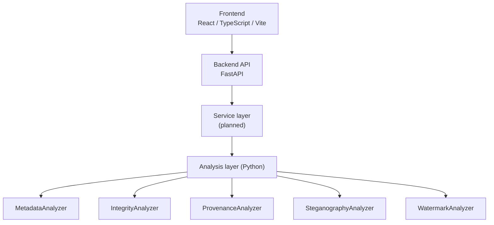

# VERIDIA

**Digital Image Provenance & Forensics Workbench**

*Veridia: Tracing Truth Through Digital Images*

> **Status: foundational / prototype architecture phase.** No forensic analysis is implemented yet. This repository currently contains the project scaffold, module boundaries and evidence model on which analysis capabilities will be built.

---

## Overview

VERIDIA is a proprietary workbench for investigating digital images from provenance, integrity and forensic perspectives. Its aim is to bring evidence handling and several complementary analysis techniques into one coherent, reproducible workflow, with every finding traceable to the evidence and method that produced it.

## Problem Statement

Investigating a digital image rarely depends on a single technique. An analyst may need to:

- inspect **metadata** for origin and consistency clues,
- verify **integrity** and look for signs of manipulation,
- search for **hidden information** (steganography),
- verify or recover **watermarks**,
- reason about the image's **provenance** and history.

These tasks are usually performed with separate, disconnected tools, with results gathered by hand. That makes work harder to reproduce, makes it harder to correlate findings across techniques, and weakens the chain from evidence to conclusion. VERIDIA aims to unify them in one workflow built around evidence preservation and explainable results.

## Vision

> **Planned architecture. Not implemented.**

```text
Evidence Intake
      ↓
Identification & Hashing
      ↓
Metadata / Provenance Analysis
      ↓
Image Integrity Analysis
      ↓
Hidden Information Analysis
      ↓
Watermark Verification
      ↓
Forensic Assessment
      ↓
Reporting
```

## Current Status

Present in the repository today:

- **Frontend scaffold:** React application shell with VERIDIA branding, sidebar navigation, a dashboard (showing backend reachability only) and placeholder views.
- **Backend scaffold:** FastAPI application with configuration and a `GET /api/health` endpoint.
- **Analysis module boundaries:** an abstract `Analyzer` contract plus five stub analyzers that raise `NotImplementedError`.
- **Evidence model:** a Pydantic schema and matching TypeScript type for an evidence artifact. There is no persistence.
- **Documentation:** this README and [docs/](docs/).
- **Minimal test:** one backend test covering the health endpoint.

Not present: file upload, hashing, metadata extraction, any forensic algorithm, database, authentication, or reporting.

## Planned Capabilities

| Module | Intended scope |
| --- | --- |
| **Evidence Management** | Safe intake of untrusted files, signature-based type identification, SHA-256 hashing, preservation of the original, and a record of every operation applied. |
| **Metadata & Provenance** | EXIF/XMP/container metadata extraction, cross-field consistency checks, and reasoning about an image's origin and processing history. |
| **Image Integrity** | Image statistics, compression-history analysis, and indicators of local or global manipulation. |
| **Steganography Analysis** | Bit-plane and LSB analysis and statistical steganalysis for signs of embedded content. |
| **Digital Watermarking** | Watermark embedding, extraction and verification, plus robustness analysis against common transformations. |
| **Forensic Investigation** | Correlation of indicators across modules, an evidence timeline, and a contextual assessment. |
| **Reporting** | Reproducible reports of findings, methods, parameters and evidence hashes. |

## Architecture



Only the frontend, the API (health endpoint) and the analyzer interfaces exist today. The service layer and all analyzer implementations are planned.

## Technology Stack

**Current Stack**

- Frontend: React 19, TypeScript, Vite, Tailwind CSS, React Router
- Backend: Python, FastAPI, Pydantic, Uvicorn
- Testing: pytest, httpx

**Planned Technologies** (not yet chosen or added)

- Image and numerical libraries for the analysis layer
- Metadata extraction libraries
- Persistence for evidence records
- Report generation

## Security Principles

VERIDIA treats every uploaded file as hostile. These principles guide the design; see [docs/security.md](docs/security.md) for details. They are **not yet implemented**.

- Uploaded files are untrusted input.
- Evidence integrity: the original is preserved and never modified.
- Cryptographic hashing (SHA-256) at intake and on every derived artifact.
- Input validation: file signature, type and size limits.
- Safe file handling: sanitized filenames, path traversal prevention, isolated temporary storage.
- Uploaded artifacts are never executed.
- Reproducible analysis: versioned analyzers with recorded parameters.
- Explainable forensic findings.

## Forensic Philosophy

VERIDIA is designed to provide **forensic indicators and supporting evidence**, not to declare an image "authentic" or "fake."

Each analytical signal is an indicator that must be interpreted in context and, where appropriate, corroborated by independent techniques. Analyzers therefore return structured, explainable indicators with their method and parameters, never a bare verdict. The final assessment is left to the investigator. See [docs/forensic-philosophy.md](docs/forensic-philosophy.md).

## Roadmap

**Phase 1: Foundation** *(current)*
- Architecture
- Frontend
- Backend
- Evidence model

**Phase 2: Evidence & Metadata**
- File identification
- Hashing
- EXIF/metadata

**Phase 3: Image Integrity**
- Image statistics
- Compression analysis
- Manipulation indicators

**Phase 4: Steganography**
- Bit-plane analysis
- LSB analysis
- Steganalysis

**Phase 5: Watermarking**
- Embedding
- Extraction
- Verification
- Robustness analysis

**Phase 6: Investigation & Reporting**
- Evidence timeline
- Cross-module findings
- Reports

**Phase 7: Research Extensions**
- Advanced provenance
- Adversarial manipulation
- Deepfake/media forensics
- Advanced statistical analysis

## Limitations

Image forensics is largely probabilistic and indicative. No single signal proves manipulation or authenticity: benign processing (recompression, resizing, platform re-encoding) can resemble tampering, and skilled adversaries can suppress many indicators. VERIDIA's output is intended to support, never replace, expert judgement. Nothing in the current prototype performs any analysis.

## Development

### Prerequisites

- Node.js 20+ and npm
- Python 3.11+

### Backend

```bash
python -m venv .venv
# Windows: .venv\Scripts\activate    macOS/Linux: source .venv/bin/activate
pip install -r requirements-dev.txt
cd backend
uvicorn app.main:app --reload --port 8000
```

Health check:

```bash
curl http://localhost:8000/api/health
# {"status":"ok","service":"VERIDIA","version":"0.1.0"}
```

Interactive API docs are served at <http://localhost:8000/docs>.

### Frontend

```bash
cd frontend
npm install
npm run dev        # http://localhost:5173, proxies /api to port 8000
npm run build      # type-check and production build
```

### Tests

From the repository root, with the virtual environment active:

```bash
pytest
```

### Project Structure

```text
veridia/
├── frontend/            React + TypeScript + Vite + Tailwind application shell
│   └── src/             components, pages, features, services, types
├── backend/
│   └── app/             FastAPI app: api, core (config), schemas (evidence model), services
├── analysis/            Forensic analysis layer (interfaces only)
│   ├── core/            Shared Analyzer contract
│   ├── metadata/  integrity/  steganography/  watermarking/  provenance/
├── tests/               Backend tests
└── docs/                Architecture, security and forensic philosophy
```

## License

Proprietary. All rights reserved.
