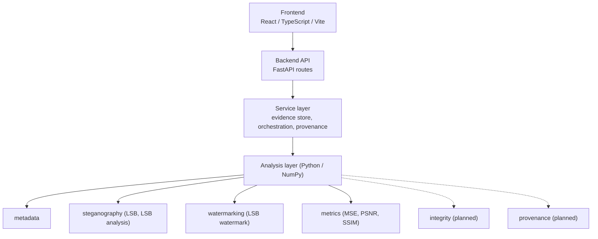

# VERIDIA

**Digital Image Provenance & Forensics Workbench**

*Veridia: Tracing Truth Through Digital Images*

> **Status: Phase 2, first functional vertical slice.** Evidence intake, hashing, metadata extraction, LSB steganography, a basic spatial-domain watermark, quality metrics and a provenance record work end to end. Advanced watermarking, steganalysis and forensic manipulation analysis are **not** implemented yet; see [Planned](#planned).

---

## Overview

VERIDIA is a proprietary workbench for investigating and experimenting with digital images from provenance, integrity and information-hiding perspectives. It brings evidence handling and several complementary techniques into one reproducible workflow, with every derived image linked to its source by a cryptographic hash.

## Academic Alignment

VERIDIA is developed for a **Digital Watermarking & Steganography** course. Watermarking and steganography are its technical core; the provenance and forensics layer exists to support and contextualize them.

```text
Digital Watermarking
        ↓
Ownership / Authentication / Integrity
        ↓
Digital Image Provenance

Steganography
        ↓
Information Concealment
        ↓
Steganalysis / Forensic Investigation
```

The algorithms are implemented directly with NumPy rather than by wrapping a steganography or watermarking library. Pillow is used only to decode and encode image files.

### Watermarking vs. steganography

The two share low-level mechanisms (here, both modify least significant bits) but have different goals:

| | Steganography | Digital watermarking |
| --- | --- | --- |
| **Purpose** | Conceal communication or data inside a carrier | Associate information with media: ownership, authentication, integrity, provenance |
| **Secrecy** | The *existence* of the message should go unnoticed | The mark need not be secret; it must be recoverable and verifiable |
| **Typical priority** | Capacity and imperceptibility | Verifiability and (for robust schemes) resistance to processing |
| **In VERIDIA** | Sequential LSB embedding of text, up to full capacity | Short, CRC-protected message repeated across the image at key-derived positions |

## Problem Statement

Investigating a digital image rarely depends on one technique. An analyst may need to inspect metadata, verify integrity, search for hidden information, verify watermarks and reason about provenance. These tasks are usually done in separate tools, which makes results hard to reproduce and correlate. VERIDIA aims to unify them around evidence preservation and explainable results.

## Current Status

### Implemented

- **Evidence ingestion:** upload of PNG/JPEG/BMP with extension, file-signature and decode validation; size (10 MB) and pixel (8 MP) limits; sanitized filename; unique evidence ID; SHA-256; dimensions; timestamp. The original bytes are stored unmodified.
- **Metadata extraction:** format, dimensions, colour mode, bit depth, ICC profile and EXIF (including Exif and GPS sub-IFDs). Each field is reported as *available*, *not available* or *unknown*; nothing is inferred.
- **LSB steganography:** embed and extract UTF-8 text, capacity calculation and utilization, rejection of over-capacity payloads, graceful handling of images without a payload.
- **LSB-plane analysis:** per-channel (R, G, B) LSB plane images and simple statistics.
- **Digital watermarking:** keyed, redundant, invisible spatial-domain watermark with embed and verify/extract.
- **Quality metrics:** MSE, PSNR, SSIM between original and processed images.
- **Comparison:** original vs. stego/watermarked images with file size, hash and metrics.
- **Provenance record:** each processing step records input/output hashes, time, safe parameters and metrics, held in memory.
- **Frontend:** Dashboard, Evidence, Steganography, Watermarking, Comparison and Provenance views.
- **Tests:** 27 focused backend/analysis tests.

### Planned

Integrity and manipulation analysis, advanced watermarking, advanced steganalysis, persistence, reporting. See the [Roadmap](#roadmap).

## Technical Methodology

### Cryptographic hashing
SHA-256 is computed over the exact uploaded bytes and over every generated file. Any change to a file, however visually imperceptible, changes its hash, so a processed image never shares the original's hash. Hashes link each derived artifact to its source.

### LSB steganography
The cover is decoded to 8-bit RGB. The least significant bit of each colour sample, taken in row-major order (R, G, B per pixel), carries one payload bit. Changing an LSB alters a sample by at most 1 of 255, which is normally imperceptible. The stream is `"VRDS" | 4-byte length | payload`. Capacity is `H·W·3/8 − 8` bytes. Outputs are always lossless PNG, because lossy compression (JPEG) would destroy the hidden bits.
*Limitations:* the payload is not encrypted, the layout is sequential and the header is a fixed marker, so the scheme is easy to detect and read. It is a teaching baseline, not a secure channel.

### LSB-plane analysis
The LSB of one channel is rendered as a black/white image. For each channel VERIDIA reports the fraction of LSBs equal to 1 and the fraction of horizontally adjacent LSB pairs that differ (about 0.5 for random bits). It also reports whether the stream starts with VERIDIA's own header. These are **LSB characteristics and potential indicators**: natural images, noise and prior processing can look similar, and a small payload may change nothing visible. They do not establish that data is hidden.

### Digital watermarking
A 73-byte block (`"VRDW" | length | message padded to 64 bytes | CRC-32`) is repeated cyclically over every colour sample. Bit *k* of the repeated stream is written to the LSB of sample `perm[k]`, where `perm` is a pseudo-random permutation seeded by SHA-256 of the key, so the result is deterministic. Verification re-derives the permutation, takes a per-bit majority vote across the copies, and checks the magic value and CRC. The result is *verified*, *mismatch*, *extracted* (no expected message supplied) or *not found*.
*Limitations:* this is a **fragile** watermark. JPEG compression, resizing, cropping and filtering destroy it; only sparse random bit damage is tolerated. With an empty key the positions are public, and a key only hides the bit locations; it does not authenticate the image. Embedding overwrites all LSBs, so it erases any LSB steganography payload.

### Image-quality metrics
- **MSE:** mean squared difference over all samples. 0 means identical; lower means less pixel-level change.
- **PSNR:** `10·log₁₀(255² / MSE)` in dB. Higher generally indicates closer agreement with the original; it is undefined (shown as ∞) for identical images.
- **SSIM:** structural similarity (Wang et al., 2004) computed over a 7×7 uniform sliding window and averaged over R, G, B. 1.0 means identical. Other libraries use a Gaussian window, so values can differ slightly.

No "good" or "bad" threshold is claimed; interpretation depends on the application.

### Provenance tracking
Each processing step is recorded as: source evidence ID and SHA-256 → operation → output artifact ID and SHA-256, with timestamp, safe parameters (payloads, messages and keys are never recorded) and quality metrics. This is the beginning of a provenance chain.

```text
Original Image ── SHA-256 ──▶ LSB Steganography ──▶ Output SHA-256 + payload size + quality metrics
Original Image ── SHA-256 ──▶ Watermark Embedding ──▶ Output SHA-256 + watermark metadata + quality metrics
```

Records are held in server memory and lost on restart. They are not tamper-evident and do not yet chain steps on derived images.

## Planned Capabilities

| Module | Intended scope |
| --- | --- |
| **Evidence Management** | Persistent storage, preserved read-only originals, an operation log. |
| **Metadata & Provenance** | Metadata consistency checks and richer origin/history reasoning. |
| **Image Integrity** | Image statistics, compression-history analysis, manipulation indicators. |
| **Steganography Analysis** | Statistical steganalysis beyond basic LSB characteristics. |
| **Digital Watermarking** | Transform-domain and robust watermarking, attacks, robustness evaluation. |
| **Forensic Investigation** | Cross-module correlation and evidence timelines. |
| **Reporting** | Reproducible reports of findings, methods, parameters and hashes. |

## Architecture



Route handlers only validate and delegate. Algorithms live in `analysis/` and are usable and testable without the web layer.

## Technology Stack

- Frontend: React 19, TypeScript, Vite, Tailwind CSS, React Router
- Backend: Python, FastAPI, Pydantic, Uvicorn, python-multipart
- Analysis: NumPy, Pillow (image file decode/encode, metadata read)
- Testing: pytest, httpx

## Security Principles

Uploaded files are untrusted. Details and status are in [docs/security.md](docs/security.md).

- **Implemented in this phase:** signature + extension + decode validation; size and pixel limits; sanitized display filenames; server-generated IDs (no user-controlled paths); files never executed; images served with `nosniff`; SHA-256 at intake and for derived files; original bytes preserved unmodified; payloads and keys excluded from provenance.
- **Not yet implemented:** persistent or on-disk storage, rate limiting, authentication, streaming size enforcement during upload.

## Forensic Philosophy

VERIDIA reports **forensic indicators and supporting evidence**, not verdicts. It does not declare an image "authentic" or "fake," and it does not claim steganography is "detected" from a bit-plane statistic. Each indicator should be interpreted in context and corroborated by independent techniques. See [docs/forensic-philosophy.md](docs/forensic-philosophy.md).

## Roadmap

**Phase 1: Foundation** ✔
**Phase 2: Core Watermarking & Steganography Pipeline** ✔ (this release)
- Evidence intake, hashing, metadata, LSB steganography, LSB analysis, basic watermarking, quality metrics, provenance record

**Phase 3: Advanced Watermarking**
- DCT-domain and DWT-domain watermarking
- Robust and fragile watermarking
- Watermark attacks and robustness evaluation

**Phase 4: Advanced Steganalysis**
- Statistical analysis and improved LSB detection
- Histogram analysis and channel correlation
- Other spatial-domain steganalysis techniques

**Phase 5: Forensic Investigation**
- Manipulation indicators and compression analysis
- Advanced provenance and evidence timelines
- Investigation reports

## Limitations

- Image forensics is largely probabilistic; no single signal proves manipulation or authenticity.
- The LSB steganography and watermark are educational baselines: unencrypted, easily detectable and removable.
- Operations are on the decoded 8-bit RGB image: alpha channels are dropped, 16-bit data is reduced, and EXIF orientation is not applied. Outputs are always PNG.
- All state is in memory and lost on restart.
- Accuracy of results depends on the lossless handling of the file; do not re-save outputs as JPEG.

## Development

### Prerequisites

- Node.js 20+ and npm
- Python 3.11+

### Backend

From the repository root:

```bash
python -m venv .venv
# Windows: .venv\Scripts\activate    macOS/Linux: source .venv/bin/activate
pip install -r requirements-dev.txt
python -m uvicorn app.main:app --app-dir backend --reload --port 8000
```

Running from the root keeps the `analysis` package importable. Health check:

```bash
curl http://localhost:8000/api/health
# {"status":"ok","service":"VERIDIA","version":"0.2.0"}
```

Interactive API docs: <http://localhost:8000/docs>.

### Frontend

```bash
cd frontend
npm install
npm run dev        # http://localhost:5173, proxies /api to port 8000
npm run build      # type-check and production build
```

### Using the workflow

1. Open the **Evidence** page and upload a PNG, JPEG or BMP.
2. **Steganography:** enter text, embed, download, then extract; inspect the LSB planes.
3. **Watermarking:** enter a message and optional key, embed, then verify.
4. **Comparison / Provenance:** review metrics, hashes and the processing chain.

### Tests

From the repository root, with the virtual environment active:

```bash
pytest
```

### API

| Method | Path | Purpose |
| --- | --- | --- |
| GET | `/api/health` | Health check |
| POST | `/api/evidence/upload` | Ingest an image |
| GET | `/api/evidence`, `/api/evidence/{id}` | List / fetch evidence |
| GET | `/api/images/{id}[?download=true]` | Original or derived image |
| GET | `/api/steganography/capacity/{id}` | LSB capacity |
| POST | `/api/steganography/embed` | Embed payload |
| POST | `/api/steganography/extract` | Extract payload |
| GET | `/api/steganography/analyze/{id}` | LSB statistics |
| GET | `/api/steganography/lsb-plane/{id}/{channel}` | LSB-plane image |
| POST | `/api/watermark/embed` | Embed watermark |
| POST | `/api/watermark/verify` | Verify / extract watermark |
| POST | `/api/analysis/compare` | Quality metrics for two images |

### Project Structure

```text
veridia/
├── frontend/            React + TypeScript + Vite + Tailwind
│   └── src/             components, pages, features, services, types
├── backend/app/         FastAPI: api (routes), core (config), schemas, services (store, orchestration)
├── analysis/            Independent forensic algorithms
│   ├── core/            Hashing, image decode/encode, Analyzer contract
│   ├── metadata/        Metadata/EXIF extraction
│   ├── steganography/   LSB embed/extract, LSB-plane analysis
│   ├── watermarking/    Keyed LSB watermark
│   ├── metrics/         MSE, PSNR, SSIM
│   └── integrity/  provenance/   Interfaces only (not implemented)
├── tests/               pytest suite
└── docs/                Architecture, security, forensic philosophy
```

## License

Proprietary. All rights reserved.
