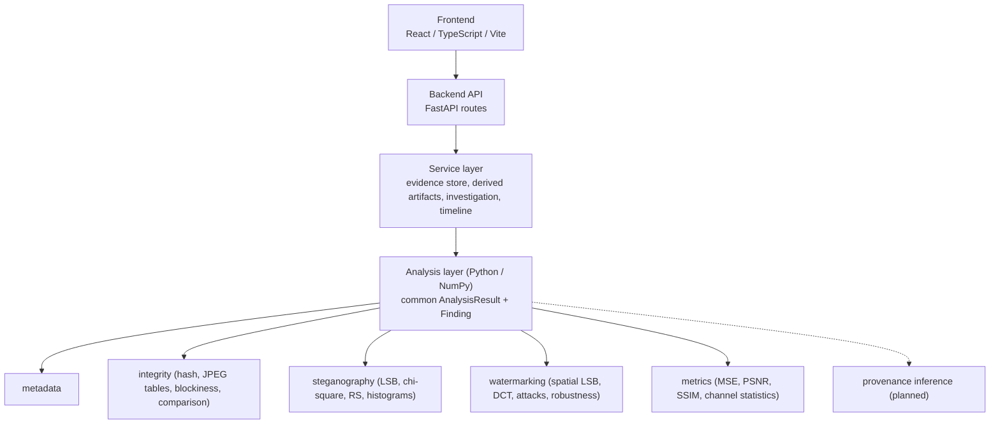

# VERIDIA

**Digital Image Provenance & Forensics Workbench**

*Veridia: Tracing Truth Through Digital Images*

> **Status: Phase 4, research prototype.** Evidence intake, metadata, LSB steganography, spatial- and DCT-domain watermarking, robustness experiments, statistical steganalysis, image-integrity analysis and forensic comparison are connected in one investigation workflow with a provenance chain and timeline. Manipulation localisation, persistence and reporting are **not** implemented; see [Planned](#planned).

---

## Overview

VERIDIA is a proprietary workbench for investigating and experimenting with digital images from provenance, integrity and information-hiding perspectives. It brings evidence handling and several complementary techniques into one reproducible workflow, with every derived image linked to its source by a cryptographic hash.

## Academic Alignment

VERIDIA is developed for a **Digital Watermarking & Steganography** course. Watermarking and steganography are its technical core; the provenance and forensics layer exists to support and contextualize them.

```text
DIGITAL WATERMARKING                         STEGANOGRAPHY
        │                                            │
        ├── Ownership                                ├── Information hiding
        ├── Authentication                           └── LSB embedding
        ├── Integrity                                        │
        └── Robustness                                       ▼
                │                                    STEGANALYSIS
                ▼                                            │
        IMAGE PROVENANCE  ──────────────▶  FORENSIC INVESTIGATION  ◀──
                                         (evidence, integrity, comparison, timeline)
```

In VERIDIA these meet in one workflow: an evidence image is hashed and recorded; watermarking and steganography create **derived artifacts** linked to it; and the investigation view runs metadata, integrity, steganalysis, watermark verification and comparison on any of those images. For example, the integrity module detects the 8×8 block structure the DCT watermark leaves in a PNG, and the comparison module shows that LSB embedding changes pixels only by ±1.

The algorithms are implemented directly with NumPy rather than by wrapping a steganography or watermarking library. Pillow is used only to decode and encode image files.

### Watermarking vs. steganography

The two share low-level mechanisms (here, both modify least significant bits) but have different goals:

| | Steganography | Digital watermarking |
| --- | --- | --- |
| **Purpose** | Conceal communication or data inside a carrier | Associate information with media: ownership, authentication, integrity, provenance |
| **Secrecy** | The *existence* of the message should go unnoticed | The mark need not be secret; it must be recoverable and verifiable |
| **Typical priority** | Capacity and imperceptibility | Verifiability and (for robust schemes) resistance to processing |
| **In VERIDIA** | Sequential LSB embedding of text, up to full capacity | Short, CRC-protected message repeated across the image at key-derived positions |

## Problem Statement

Investigating a digital image rarely depends on one technique. An analyst may need to inspect metadata, verify integrity, search for hidden information, verify watermarks and reason about provenance. These tasks are usually done in separate tools, which makes results hard to reproduce and correlate. VERIDIA aims to unify them around evidence preservation and explainable results.

## Current Status

### Implemented

- **Evidence ingestion:** upload of PNG/JPEG/BMP with extension, file-signature and decode validation; size (10 MB) and pixel (8 MP) limits; sanitized filename; unique evidence ID; SHA-256; dimensions; timestamp. The original bytes are stored unmodified.
- **Metadata extraction:** format, dimensions, colour mode, bit depth, ICC profile and EXIF (including Exif and GPS sub-IFDs). Each field is reported as *available*, *not available* or *unknown*; nothing is inferred.
- **LSB steganography:** embed and extract UTF-8 text, capacity calculation and utilization, rejection of over-capacity payloads, graceful handling of images without a payload.
- **Steganalysis:** per-channel statistics (mean, std, entropy, LSB ratios), histograms and pair-of-values differences, the chi-square attack (whole image and sequential prefixes), RS analysis, LSB-plane images, and a direct known-cover vs. suspected-image comparison. Results are reported as measurements and potential indicators.
- **Spatial-domain watermarking:** keyed, redundant LSB watermark with embed and verify/extract.
- **DCT-domain watermarking:** blind watermark in the relation between two mid-frequency coefficients of 8×8 luminance DCT blocks, with adjustable strength, embed and verify/extract, and a DCT-coefficient visualisation.
- **Robustness testing:** JPEG recompression, resize-and-restore, Gaussian noise, brightness, contrast and border crop; single experiments (stored with provenance) or a full suite, reporting PSNR/SSIM, raw bit error rate and verification status.
- **Method comparison:** spatial vs. DCT watermark on the same image and message: imperceptibility, verification and the same attack suite, side by side.
- **Quality metrics:** MSE, PSNR, SSIM between original and processed images.
- **Evidence object and provenance chain:** each evidence item records its identity, metadata, every **derived artifact** (own ID and SHA-256, parent image and parent hash, operation, timestamp), every image-producing operation, every recorded analysis result, and a **timeline** of the operations the application performed.
- **Common analysis results:** every analyzer returns the same structure (status, measurements, findings, interpretation, limitations, timestamp). Each **finding** states the observation, the measurement supporting it, what it may indicate, and what it does *not* establish.
- **Image-integrity analysis:** SHA-256 re-verification, format and image characteristics, R/G/B/grayscale statistics and histograms, JPEG quantization tables with IJG quality estimation, chroma subsampling, and an 8×8 blockiness measurement for compression history in lossless files.
- **Forensic comparison:** reference vs. derived/suspected image with side-by-side view, difference map, MSE/PSNR/SSIM, changed-pixel statistics, histogram overlay and channel statistics.
- **Investigation workflow:** one view per evidence item that runs metadata → integrity → steganalysis → (watermark verification) → (comparison with the original) on the original or any derived artifact, and shows the findings, the artifact tree and the timeline.
- **Frontend:** Dashboard, Evidence, Investigation, Steganography, Steganalysis, Watermarking (Spatial / DCT / Compare Methods / Robustness Testing), Comparison and Provenance views.
- **Tests:** 66 focused backend/analysis tests.

### Planned

Manipulation localisation, DWT-domain and geometrically robust watermarking, further steganalysis (e.g. sample-pair analysis, LSB matching), persistence, reporting. See the [Roadmap](#roadmap).

## Technical Methodology

### Cryptographic hashing
SHA-256 is computed over the exact uploaded bytes and over every generated file. Any change to a file, however visually imperceptible, changes its hash, so a processed image never shares the original's hash. Hashes link each derived artifact to its source.

### LSB steganography
The cover is decoded to 8-bit RGB. The least significant bit of each colour sample, taken in row-major order (R, G, B per pixel), carries one payload bit. Changing an LSB alters a sample by at most 1 of 255, which is normally imperceptible. The stream is `"VRDS" | 4-byte length | payload`. Capacity is `H·W·3/8 − 8` bytes. Outputs are always lossless PNG, because lossy compression (JPEG) would destroy the hidden bits.
*Limitations:* the payload is not encrypted, the layout is sequential and the header is a fixed marker, so the scheme is easy to detect and read. It is a teaching baseline, not a secure channel.

### Steganalysis
All outputs are **measurements and potential indicators**. Natural images, noise and prior processing can produce similar values, and a small or well-spread payload may produce none; nothing here establishes that data is hidden.
- **LSB planes and channel statistics:** LSB-plane images; per channel the mean, standard deviation, entropy, fraction of LSBs equal to 1 and fraction of differing horizontal LSB neighbours (≈0.5 for random bits).
- **Histogram / chi-square attack** (Westfeld & Pfitzmann): LSB replacement only moves values within pairs (2k, 2k+1), so random message bits equalise each pair's counts. A chi-square test against perfectly equalised pairs gives *p*; *p* close to 1 is consistent with embedding. Run over growing prefixes of the sample stream, it exposes sequential embedding (high *p* over the embedded prefix, then a drop). It assumes random-looking message bits (encrypted or compressed). Plain ASCII text has a fixed 0 bit in every byte and often goes unflagged.
- **RS analysis** (Fridrich, Goljan & Du): pixel groups are classified as Regular/Singular under LSB flipping with a mask and its shifted counterpart. Embedding moves these counts in a predictable way, which gives an estimate of the fraction of samples carrying message bits. Expect a few percent of bias on clean images; the estimate is undefined near full embedding. Treat it as an experimental detector.
- **Known cover vs. suspected image:** when the true cover is available, changes are measured directly (count, location range, largest change, LSB-only or not) instead of inferred.

Indicator thresholds (chi-square *p* > 0.95; RS estimate > 10%) are heuristics documented in `analysis/steganography/steganalysis.py`. VERIDIA's own payload header is reported separately as a direct format match.

### Spatial-domain watermarking
A 73-byte block (`"VRDW" | length | message padded to 64 bytes | CRC-32`) is repeated cyclically over every colour sample. Bit *k* of the repeated stream is written to the LSB of sample `perm[k]`, where `perm` is a pseudo-random permutation seeded by SHA-256 of the key, so the result is deterministic. Verification re-derives the permutation, takes a per-bit majority vote across the copies, and checks the magic value and CRC. The result is *verified*, *mismatch*, *extracted* (no expected message supplied) or *not found*.
*Limitations:* this is a **fragile** watermark. JPEG compression, resizing, cropping and filtering destroy it; only sparse random bit damage is tolerated. With an empty key the positions are public, and a key only hides the bit locations; it does not authenticate the image. Embedding overwrites all LSBs, so it erases any LSB steganography payload.

### DCT-domain watermarking
The image is converted to YCbCr and the luminance channel is split into 8×8 blocks. Each block is transformed with the 2-D DCT-II (implemented directly as `D·B·Dᵀ`). Each block carries one bit in the relation between coefficients C(4,1) and C(3,2): their difference is pushed to ≥ +*strength* for a 1 and ≤ −*strength* for a 0. These mid-frequency positions avoid the most visible low frequencies and the high frequencies that JPEG discards first, and they share the same JPEG quantisation step, so recompression tends to preserve their difference. The payload (`length | message ≤ 16 bytes | CRC-32`, 168 bits) is repeated over all blocks at key-permuted positions. After the inverse DCT the image is converted back to RGB.
Extraction is **blind** (no original needed): recompute the block DCTs, combine each bit's copies by clipped soft voting, and check the CRC. If the original is supplied, it is used only to report metrics against it.
*Limitations:* no geometric resynchronisation, so rotation, true cropping or any shift of the 8×8 grid prevents extraction (the resize attack restores the original size). Capacity is 16 bytes, and at least 504 blocks (≈180×180 px) are needed. Strength trades imperceptibility for robustness, and the default (25) was chosen from measurements on test images, not derived.

### Robustness testing
Attacks (`analysis/watermarking/attacks.py`) are JPEG recompression, resize-and-restore, seeded Gaussian noise, brightness shift, contrast scaling and border crop (filled with black; dimensions kept). Each attack keeps the image dimensions. For each attack VERIDIA records the parameter, the attack's distortion (MSE/PSNR/SSIM relative to the watermarked image), the **raw bit error rate** (carrier bits that differ from what was embedded, before voting) and whether the watermark still verifies. No aggregate "security score" is computed.

Example, measured once on a 512×384 synthetic test image (message `VERIDIA`, DCT strength 25). These are not general claims:

| | PSNR | SSIM | Verified after attack (15 presets) |
| --- | ---: | ---: | ---: |
| Spatial LSB watermark | 51.0 dB | 0.996 | 3 / 15 (brightness ×2, 10% crop) |
| DCT watermark | 41.2 dB | 0.943 | 13 / 15 (failed: JPEG q30, 25% crop) |

### Image-quality metrics
- **MSE:** mean squared difference over all samples. 0 means identical; lower means less pixel-level change.
- **PSNR:** `10·log₁₀(255² / MSE)` in dB. Higher generally indicates closer agreement with the original; it is undefined (shown as ∞) for identical images.
- **SSIM:** structural similarity (Wang et al., 2004) computed over a 7×7 uniform sliding window and averaged over R, G, B. 1.0 means identical. Other libraries use a Gaussian window, so values can differ slightly.

No "good" or "bad" threshold is claimed; interpretation depends on the application.

### Image-integrity analysis
- **Hash re-verification:** the stored bytes are re-hashed and compared with the SHA-256 recorded on entry. This shows integrity *since acquisition*, not before it.
- **JPEG compression:** quantization tables are read from the file. Most encoders scale the standard tables (ITU-T T.81 Annex K) with the IJG formula (`scale = 5000 // Q` for Q < 50, `200 − 2Q` otherwise), so VERIDIA estimates quality as the Q whose scaled table is closest. It reproduces Pillow-encoded qualities 1–100 exactly. Non-standard tables (typical of camera firmware) are reported as such, with an approximate estimate.
- **Blockiness:** the ratio of luminance steps across 8×8 block boundaries to steps inside blocks. It is ≈1.0 without block structure. Measured on synthetic test images: JPEG q95 ≈1.13, q50 ≈2.1, VERIDIA's DCT watermark ≈1.36. In a *lossless* file a ratio above 1.10 is reported as a potential indicator of earlier JPEG or block-DCT processing; the threshold is a heuristic, not a calibrated detector.
- **Channel statistics:** mean, standard deviation, min and max, plus histograms, for R, G, B and grayscale (BT.601 luma).

No finding from this module claims that compression or statistics prove manipulation.

### Analysis results and findings
Every analyzer (`analysis/core/base.py`) returns `status`, `measurements`, `findings`, `interpretation`, `limitations` and `timestamp`. Status is one of **Verified** (a definite check succeeded, e.g. a watermark matched), **Indicator detected**, **No indicator detected**, **Inconclusive** or **Not applicable**. Each finding has four parts:

```text
Finding:        Image is JPEG compressed
Evidence:       2 quantization tables; luminance table matches IJG quality 88 (deviation 0.00)
Interpretation: The pixel data has been lossy-compressed at least once.
Limitation:     JPEG compression alone does not establish manipulation.
```

Findings are not combined into an authenticity score. No defensible model for such a score exists in this project.

### Provenance tracking
Two kinds of images are distinguished:
- **Original evidence:** the uploaded file. It is stored unmodified, and integrity analysis re-verifies its hash.
- **Derived artifacts:** images produced by steganographic embedding, watermark embedding or robustness attacks. Each has its own ID and SHA-256, a parent reference (evidence or another artifact) with the parent's hash, the operation and its parameters, a timestamp and quality metrics against the parent.

```text
Original Evidence (SHA-256)
   ├── DCT Watermark Embedding ──▶ watermarked.png (SHA-256, strength, PSNR/SSIM)
   │       └── Attack: JPEG q75 ──▶ watermarked_jpeg_75.png (SHA-256, distortion metrics)
   └── LSB Steganography ──▶ stego.png (SHA-256, payload size, PSNR/SSIM)
```

The **timeline** records only operations the application performed: acquisition, metadata extraction, hashing, artifact creation, and each recorded analysis with its result status. Analyses are recorded when run from the Investigation or Comparison views. Exploratory views (e.g. the Steganalysis page) are not recorded. Payloads, watermark messages and keys are never stored in operation records. Records are held in server memory, lost on restart, and not tamper-evident.

## Planned Capabilities

| Module | Intended scope |
| --- | --- |
| **Evidence Management** | Persistent storage, preserved read-only originals, an operation log. |
| **Metadata & Provenance** | Metadata consistency checks and richer origin/history reasoning. |
| **Image Integrity** | Manipulation localisation (e.g. error-level or noise-residual maps), double-JPEG detection. |
| **Steganography Analysis** | Further detectors (sample-pair analysis, LSB matching / ±1 embedding), calibrated evaluation on real image sets. |
| **Digital Watermarking** | DWT-domain and geometrically robust watermarking; more attack types. |
| **Forensic Investigation** | Multi-evidence cases, persistent and tamper-evident records. |
| **Reporting** | Reproducible reports of findings, methods, parameters and hashes. |

## Architecture



Route handlers only validate and delegate. Algorithms live in `analysis/` and are usable and testable without the web layer.

## Technology Stack

- Frontend: React 19, TypeScript, Vite, Tailwind CSS, React Router
- Backend: Python, FastAPI, Pydantic, Uvicorn, python-multipart
- Analysis: NumPy, Pillow (image file decode/encode, metadata read)
- Testing: pytest, httpx

## Security Principles

Uploaded files are untrusted. Details and status are in [docs/security.md](docs/security.md).

- **Implemented in this phase:** signature + extension + decode validation; size and pixel limits; sanitized display filenames; server-generated IDs (no user-controlled paths); files never executed; images served with `nosniff`; SHA-256 at intake and for derived files; original bytes preserved unmodified; payloads and keys excluded from provenance.
- **Not yet implemented:** persistent or on-disk storage, rate limiting, authentication, streaming size enforcement during upload.

## Forensic Philosophy

VERIDIA reports **forensic indicators and supporting evidence**, not verdicts. It does not declare an image "authentic" or "fake," and it does not claim steganography is "detected" from a bit-plane statistic. Each indicator should be interpreted in context and corroborated by independent techniques. See [docs/forensic-philosophy.md](docs/forensic-philosophy.md).

## Roadmap

**Phase 1: Foundation** ✔
**Phase 2: Core Watermarking & Steganography Pipeline** ✔
- Evidence intake, hashing, metadata, LSB steganography, LSB analysis, basic watermarking, quality metrics, provenance record

**Phase 3: Transform-Domain Watermarking, Robustness & Steganalysis** ✔
- DCT-domain watermarking, spatial vs. DCT comparison
- Attack suite and robustness measurement
- Channel statistics, histogram/chi-square attack, RS analysis, known-cover comparison

**Phase 4: Forensic & Provenance Integration** ✔ (this release)
- Evidence object with derived artifacts, provenance chain and timeline
- Common analysis-result and finding structure
- Image-integrity analysis (hash re-verification, JPEG tables, blockiness, channel statistics)
- Forensic comparison and unified investigation workflow

**Phase 5: Further Watermarking & Steganalysis**
- DWT-domain watermarking; geometric resynchronisation
- Sample-pair analysis, LSB matching detection
- Evaluation on real image datasets

**Phase 6: Investigation Reports & Persistence**
- Reproducible investigation reports from recorded findings
- Persistent, tamper-evident evidence records
- Manipulation localisation

## Limitations

- Image forensics is largely probabilistic; no single signal proves manipulation or authenticity.
- The LSB steganography and spatial watermark are educational baselines: unencrypted, easily detectable and removable.
- The DCT watermark has no geometric resynchronisation and a 16-byte capacity. Robustness results are measured on the image at hand and do not generalise automatically.
- Steganalysis results were validated only on synthetic test images and the tool's own embedder. The chi-square attack assumes random-looking payloads, and RS analysis is experimental. Neither is a calibrated detector.
- Robustness suites and method comparison run synchronously; on large images they can take several seconds.
- Integrity findings are descriptive. Blockiness is a heuristic calibrated on synthetic images; JPEG table analysis cannot identify devices or detect double compression.
- The timeline and analysis records are kept in memory and are not tamper-evident; they document what this session did, not the image's history before upload.
- Operations are on the decoded 8-bit RGB image: alpha channels are dropped, 16-bit data is reduced, and EXIF orientation is not applied. Outputs are always PNG.
- All state is in memory and lost on restart.
- Accuracy of results depends on the lossless handling of the file; do not re-save outputs as JPEG.

## Development

### Prerequisites

- Node.js 20+ and npm
- Python 3.11+

### Backend

From the repository root:

```bash
python -m venv .venv
# Windows: .venv\Scripts\activate    macOS/Linux: source .venv/bin/activate
pip install -r requirements-dev.txt
python -m uvicorn app.main:app --app-dir backend --reload --port 8000
```

Running from the root keeps the `analysis` package importable. Health check:

```bash
curl http://localhost:8000/api/health
# {"status":"ok","service":"VERIDIA","version":"0.4.0"}
```

Interactive API docs: <http://localhost:8000/docs>.

### Frontend

```bash
cd frontend
npm install
npm run dev        # http://localhost:5173, proxies /api to port 8000
npm run build      # type-check and production build
```

### Using the workflow

1. Open the **Evidence** page and upload a PNG, JPEG or BMP.
2. **Investigation:** run the full analysis on the original, then again on any derived artifact (optionally with watermark verification). Review the findings, the artifact tree and the timeline.
3. **Steganography:** enter text, embed, download, then extract.
4. **Steganalysis:** pick the original or a derived image as the suspected image (optionally with the evidence as known cover) and review the measurements.
5. **Watermarking:** use the *Spatial Domain* / *DCT Domain* tabs to embed and verify, *Compare Methods* for a side-by-side measurement, and *Robustness Testing* to embed, attack and attempt extraction.
6. **Comparison:** choose a reference and a derived or suspected image to compare (difference map, metrics, histograms, channel statistics).
7. **Provenance:** review derived artifacts, operations, recorded analyses and the full timeline.

### Tests

From the repository root, with the virtual environment active:

```bash
pytest
```

### API

| Method | Path | Purpose |
| --- | --- | --- |
| GET | `/api/health` | Health check |
| POST | `/api/evidence/upload` | Ingest an image |
| GET | `/api/evidence`, `/api/evidence/{id}` | List / fetch evidence |
| GET | `/api/images/{id}[?download=true]` | Original or derived image |
| GET | `/api/steganography/capacity/{id}` | LSB capacity |
| POST | `/api/steganography/embed` | Embed payload |
| POST | `/api/steganography/extract` | Extract payload |
| GET | `/api/steganalysis/report/{id}` | Statistics, histograms, chi-square, RS, indicators |
| POST | `/api/steganalysis/cover-comparison` | Known cover vs. suspected image |
| GET | `/api/steganalysis/lsb-plane/{id}/{channel}` | LSB-plane image |
| POST | `/api/watermark/embed` | Embed watermark (`method`: `spatial_lsb` or `dct`) |
| POST | `/api/watermark/verify` | Verify / extract watermark (optional `reference_id`) |
| GET | `/api/watermark/attacks` | Attack catalogue and presets |
| POST | `/api/watermark/attack` | Apply one attack and attempt extraction |
| POST | `/api/watermark/robustness` | Full attack suite |
| POST | `/api/watermark/compare-methods` | Spatial vs. DCT on the same image |
| GET | `/api/watermark/dct-map/{id}` | Block-DCT magnitude visualisation |
| POST | `/api/analysis/compare` | Quality metrics for two images (not recorded) |
| GET | `/api/analysis/difference/{a}/{b}` | Difference image |
| POST | `/api/investigation/{evidence_id}/analyses` | Run and record one analysis (`metadata`, `integrity`, `steganalysis`, `watermark`, `comparison`) |
| POST | `/api/investigation/{evidence_id}/pipeline` | Run and record the full analysis pipeline on an image |

`GET /api/evidence/{id}` returns the full evidence object: metadata, derived artifacts, operations, recorded analyses and timeline.

### Project Structure

```text
veridia/
├── frontend/            React + TypeScript + Vite + Tailwind
│   └── src/             components, pages, features, services, types
├── backend/app/         FastAPI: api (routes), core (config), schemas, services (store, artifacts, investigation, timeline)
├── analysis/            Independent forensic algorithms
│   ├── core/            Hashing, image decode/encode, Analyzer contract, AnalysisResult/Finding
│   ├── metadata/        Metadata/EXIF extraction and findings
│   ├── integrity/       Hash re-verification, JPEG tables, blockiness, forensic comparison
│   ├── steganography/   LSB embed/extract; steganalysis (histogram/chi-square, RS, LSB analysis)
│   ├── watermarking/    Spatial LSB and DCT watermarks, block DCT, attacks, robustness runner
│   ├── metrics/         MSE, PSNR, SSIM, difference map/statistics, channel statistics
│   └── provenance/      Interface only (provenance inference not implemented)
├── tests/               pytest suite
└── docs/                Architecture, security, forensic philosophy
```

## License

Proprietary. All rights reserved.
